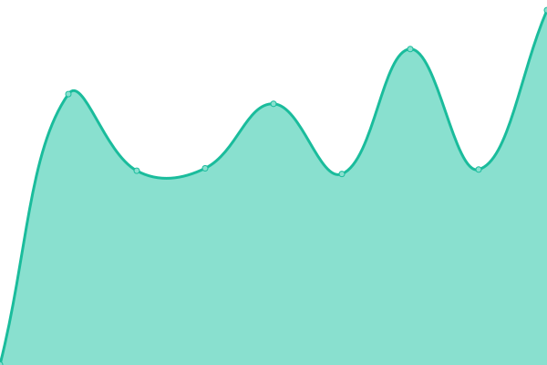

# [📈 Live Status](https://up.enymind.com): <!--live status--> **🟧 Partial outage**

This repository contains the open-source uptime monitor and status page for [Juho Tykkälä](juho.tykkala.fi), powered by [Upptime](https://github.com/upptime/upptime).

With [Upptime](https://upptime.js.org), you can get your own unlimited and free uptime monitor and status page, powered entirely by a GitHub repository. We use [Issues](https://github.com/enyone/upptime/issues) as incident reports, [Actions](https://github.com/enyone/upptime/actions) as uptime monitors, and [Pages](https://up.enymind.com) for the status page.

<!--start: status pages-->
<!-- This summary is generated by Upptime (https://github.com/upptime/upptime) -->
<!-- Do not edit this manually, your changes will be overwritten -->
<!-- prettier-ignore -->
| URL | Status | History | Response Time | Uptime |
| --- | ------ | ------- | ------------- | ------ |
|  [Live Results](https://chrono.live) | 🟩 Up | [live-results.yml](https://github.com/enyone/upptime/commits/HEAD/history/live-results.yml) | 

 3807ms
     
 | 

<a href="https://up.enymind.com/history/live-results">99.25%</a>
    

|  [Customer support portal](https://support.enymind.fi) | 🟥 Down | [customer-support-portal.yml](https://github.com/enyone/upptime/commits/HEAD/history/customer-support-portal.yml) | 

 3646ms
     
 | 

<a href="https://up.enymind.com/history/customer-support-portal">99.86%</a>
    

|  [Web site](http://www.enymind.com) | 🟩 Up | [web-site.yml](https://github.com/enyone/upptime/commits/HEAD/history/web-site.yml) | 

 4299ms
     
 | 

<a href="https://up.enymind.com/history/web-site">99.61%</a>
    

|  Chrono Cloud 2 | 🟩 Up | [chrono-cloud-2.yml](https://github.com/enyone/upptime/commits/HEAD/history/chrono-cloud-2.yml) | 

 2362ms
     
 | 

<a href="https://up.enymind.com/history/chrono-cloud-2">99.41%</a>
    

<!--end: status pages-->

[**Visit our status website →**](https://up.enymind.com)

## 📄 License

- Powered by: [Upptime](https://github.com/upptime/upptime)
- Code: [MIT](./LICENSE) © [Juho Tykkälä](juho.tykkala.fi)
- Data in the `./history` directory: [Open Database License](https://opendatacommons.org/licenses/odbl/1-0/)
